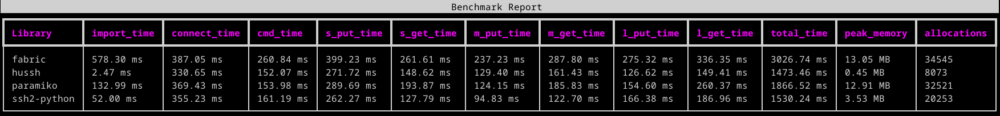

# Hussh: SSH for humans.
[](https://pypi.python.org/pypi/hussh)
[](https://pypi.python.org/pypi/hussh)

[](https://github.com/jacobcallahan/hussh/actions)

Hussh (pronounced "hush") is a client-side ssh library that offers low level performance through a high level interface.

Hussh uses [pyo3](https://docs.rs/pyo3/latest/pyo3/) to create Python bindings around the [ssh2](https://docs.rs/ssh2/latest/ssh2/) and [russh](https://docs.rs/russh/latest/russh/) libraries for Rust; these allow for synchronous and asynchronous ssh connections. 

# Installation
```
pip install hussh
```

# Table of Contents

- [QuickStart](#quickstart)
- [Why Hussh?](#why-hussh)
- [Synchronous Usage](#synchronous-usage)
- [Asynchronous Usage](#asynchronous-usage)
- [Concurrent Operations](#concurrent-operations-multiconnection)
- [Documentation](#documentation)

# QuickStart
Hussh's synchronous `Connection` class will likely be your primary interface.
```python
from hussh import Connection

conn = Connection(host="my.test.server", username="user", password="pass")
result = conn.execute("ls")
print(result.stdout)
```

That's it! One import and class instantion is all you need to:
- Execute commands
- Perform SCP actions
- Perform SFTP actions
- Get an interactive shell

# Why Hussh?
- 🔥 Blazingly fast!
- 🪶 Incredibly lightweight!
- 🧠 Super easy to use!
- ⚡ Asynchronous!
- 🥞 Concurrency!

## Benchmarks
Hussh demonstrates the performance you'd expect from a low level ssh library.
Hussh is also much lighter weight in both total memory and memory allocations.

Local Server


Remote Server


### Try it for yourself!
Hussh's benchmark script are also open sourced in the `benchmarks` directory in this repository.
Clone the repo, follow the setup instructions, then let us know how it did!

# Synchronous Usage

## Authentication
```python
from hussh import Connection

# Password authentication
conn = Connection(host="my.test.server", username="user", password="pass")

# Key-based authentication
conn = Connection(host="my.test.server", private_key="~/.ssh/id_rsa")
```

## Executing Commands
```python
result = conn.execute("whoami")
print(result.stdout, result.stderr, result.status)
```

## File Transfers (SFTP)
```python
# Write a local file to remote
conn.sftp_write(local_path="/path/to/my/file", remote_path="/dest/path/file")

# Read a remote file
contents = conn.sftp_read(remote_path="/dest/path/file")
```

📚 **For complete documentation including SCP, file tailing, interactive shells, and more, see [Synchronous Usage](docs/synchronous.md).**

# Asynchronous Usage

Hussh offers an `AsyncConnection` class for asynchronous operations.

```python
import asyncio
from hussh.aio import AsyncConnection

async def main():
    async with AsyncConnection(host="my.test.server", username="user", password="pass") as conn:
        result = await conn.execute("ls")
    print(result.stdout)

asyncio.run(main())
```

📚 **For complete documentation including timeouts, async SFTP, interactive shells, and file tailing, see [Asynchronous Usage](docs/asynchronous.md).**

# Concurrent Operations (MultiConnection)

When you need to execute commands or transfer files across multiple hosts simultaneously, use `MultiConnection`.

```python
from hussh.multi_conn import MultiConnection

# Create connections with shared authentication
mc = MultiConnection.from_shared_auth(
    hosts=["server1", "server2", "server3"],
    username="user",
    password="pass",
)

# Execute on all hosts
with mc:
    results = mc.execute("whoami")
    for host, result in results.items():
        print(f"{host}: {result.stdout.strip()}")
```

📚 **For complete documentation including `MultiResult` handling, SFTP operations, file tailing, error handling, and concurrency control, see [MultiConnection Usage](docs/multi-connection.md).**

# Documentation

For detailed guides and complete API documentation, see the [docs](docs/) directory:

| Guide | Description |
|-------|-------------|
| [Synchronous Usage](docs/synchronous.md) | Full `Connection` documentation: auth, SFTP, SCP, tailing, shells |
| [Asynchronous Usage](docs/asynchronous.md) | Full `AsyncConnection` documentation: timeouts, async operations |
| [MultiConnection Usage](docs/multi-connection.md) | Concurrent operations across multiple hosts |

# Disclaimer
This is an early project that should not be used in sensitive production code!
With that said, try it out and let me know your thoughts!

# Future Features
- Low level bindings
- TBD...
